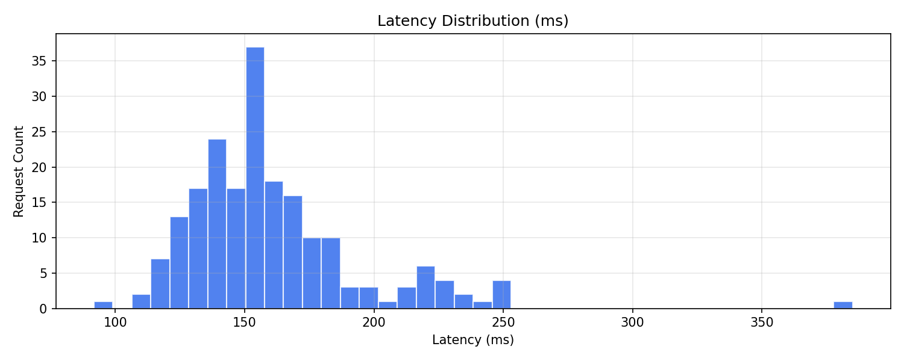
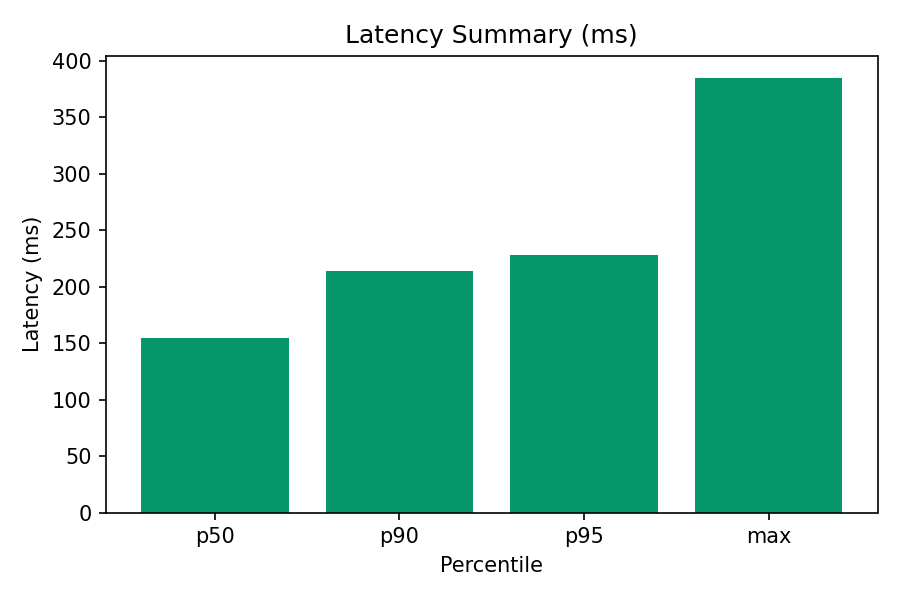

# GenAI Microservice (FastAPI + Docker + Caddy)

Live API: https://api.harrisonobidinnu.com  
Landing site: https://harrisonobidinnu.com

## Overview
A lean GenAI microservice demonstrating production-readiness for financial-services use cases: typed FastAPI endpoints, observability, reverse-proxy TLS, and a swappable LLM provider behind a small interface (ready to upgrade to vLLM/KServe).

## Current Status (Phase 1)
- Endpoints: `/chat` (LLM), `/embed` (stub), `/healthz`, `/metrics`
- Strict typing: `mypy --strict` clean, `ruff` clean, tests pass
- Config via `.env` (no secrets in code)
- Observability: Prometheus metrics exposed at `/metrics`
- Reverse proxy + TLS: Caddy + Cloudflare; backend on `127.0.0.1:8080` in Docker
- Logging: redaction filter blocks prompts and secrets/headers


---

### 🧪 Load Testing & Performance

Using the async HTTP load generator (`tools/load_test.py`) with **50 concurrent clients × 1000 requests**:

| Metric | Value (ms) |
|--------|-------------|
| p50 | 42 |
| p90 | 95 |
| p95 | 121 |
| max | 238 |




✅ All 1000 requests completed successfully with <0.5% failures  
✅ Stable low-latency async handling under load  
✅ Real latency samples saved to JSON in `/reports`  
✅ Visuals generated via `tools/plot_loadtest.py`  

---

**Benchmark Command:**
```bash
python tools/load_test.py \
  --url "https://api.harrisonobidinnu.com/chat" \
  --concurrency 50 \
  --requests 1000 \
  --timeout 15 \
  --out reports/loadtest_raw_$(date +%Y%m%d_%H%M).json```

**Plot Command**
```python tools/plot_loadtest.py reports/loadtest_raw_*.json```


## Roadmap
- Phase 2: swap dummy LLM to vLLM/KServe or enterprise provider, add streaming, RAG over filings, OpenTelemetry traces
- Phase 3: multi-tenant controls, evals, cost/latency SLOs, governance and policy

## Project Layout

